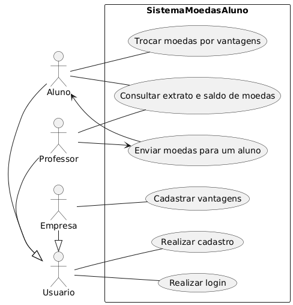
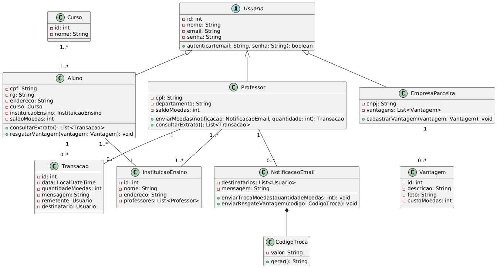
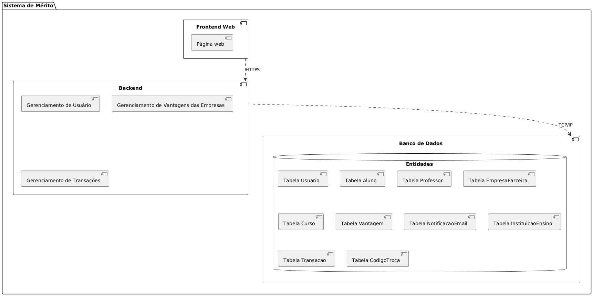

## LabDesenvDeSoftware
Repositório da matéria de Laboratório de Desenvolvimento de Software da do curso de Engenharia de Software da PUC Minas. 
A seguir, são apresentados os artefatos do laboratório atual (Laboratório 3).

# Diagrama de caso de uso

# Diagrama de classes

# Diagrama de componentes

# Diagrama de implantação
[Diagrama de implantação](laboratorio3/projeto/diagramaImplantacao/diagramaDeImplantacao.png)

<!--# Diagrama de pacotes
-->
---

# Histórias de Usuário

### Usuário 

Como usuário, 
Eu quero **acessar o sistema com login e senha**  
Para utilizar as funcionalidades de moedas de forma segura.

Como usuário,  
Eu quero **me cadastrar informando meus dados específicos**  
Para participar do sistema de mérito como aluno, empresa ou professor.

Como usuário, 
Eu quero **consultar meu extrato de transações**  
ParaPara acompanhar minha movimentação de moedas e saber meu saldo de moedas.

### Aluno 

Como aluno,  
Eu quero **ser notificado por email ao receber moedas de um professor**  
Para saber que fui reconhecido por uma boa ação ou desempenho.

Como aluno,  
Eu quero **trocar moedas por vantagens oferecidas no sistema**  
Para usufruir de benefícios como descontos e produtos.

Como aluno,  
Eu quero **receber um cupom por email com um código da troca realizada**  
Para poder utilizar a vantagem presencialmente com a empresa parceira.

### Professor 

Como professor,  
Eu quero **enviar moedas para um aluno informando o motivo do reconhecimento**  
Para valorizar comportamentos positivos como participação ou dedicação.

### Empresa Parceira 

Como empresa parceira,  
Eu quero **me cadastrar informando meus dados e vantagens oferecidas**  
Para participar do sistema e alcançar o público universitário.

Como empresa parceira,  
Eu quero **cadastrar vantagens com descrição, imagem e custo em moedas**  
Para torná-las disponíveis para resgate pelos alunos.

Como empresa parceira,  
Eu quero **receber um email sempre que uma vantagem for resgatada**  
Para poder preparar a entrega e validar o uso do benefício.

Como empresa parceira,  
Eu quero **visualizar o código de troca enviado ao aluno**  
Para confirmar a legitimidade da transação no momento do uso.
