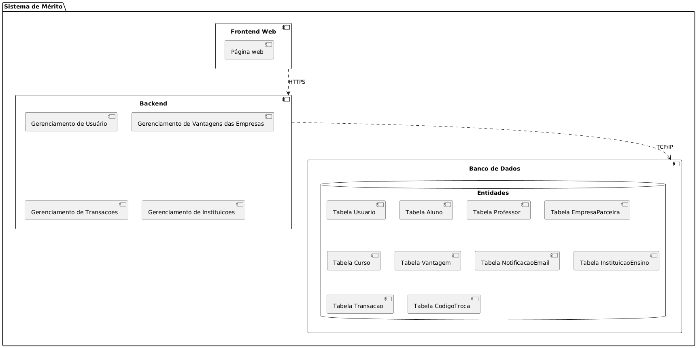
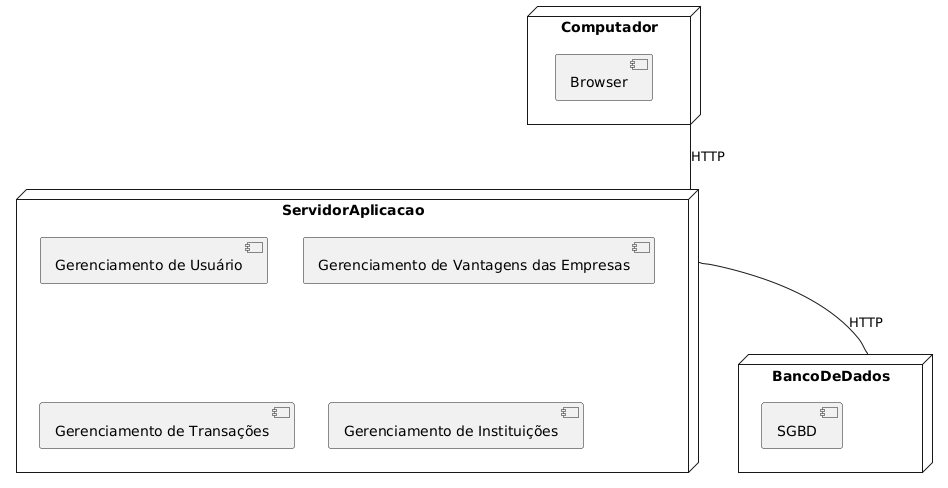

## LabDesenvDeSoftware
Repositório da matéria de Laboratório de Desenvolvimento de Software da do curso de Engenharia de Software da PUC Minas. 
A seguir, são apresentados os artefatos do laboratório atual (Laboratório 3).

# Diagrama de caso de uso

# Diagrama de classes

# Diagrama de componentes

# Diagrama de implantação

<!--# Diagrama de pacotes
-->
---

# Histórias de Usuário

### Usuário 

Como usuário, 
Eu quero **acessar o sistema com login e senha**  
Para utilizar as funcionalidades de moedas de forma segura.

Como usuário,  
Eu quero **me cadastrar informando meus dados específicos**  
Para participar do sistema de mérito como aluno, empresa ou professor.

### Aluno 

Como aluno,  
Eu quero **ser notificado por email ao receber moedas de um professor**  
Para saber que fui reconhecido por uma boa ação ou desempenho.

Como aluno,  
Eu quero **trocar moedas por vantagens oferecidas no sistema**  
Para usufruir de benefícios como descontos e produtos.

Como aluno,  
Eu quero **consultar extrato**  
Para saber como e quando recebi ou gastei minhas moedas, mantendo controle sobre minhas transações.

### Professor 

Como professor,  
Eu quero **enviar moedas para um aluno informando o motivo do reconhecimento**  
Para valorizar comportamentos positivos como participação ou dedicação.

Como professor,  
Eu quero **consultar extrato**  
Para saber como e quando recebi ou gastei minhas moedas, mantendo controle sobre minhas transações.

### Empresa Parceira 

Como empresa parceira,  
Eu quero **cadastrar vantagens com descrição, imagem e custo em moedas**  
Para torná-las disponíveis para resgate pelos alunos.

Como empresa parceira,
Eu quero **gerenciar as regras de distribuição de moedas**
Para garantir justiça e transparência no sistema de recompensas.

## Como utilizar
**Abra o projeto**
**Navegue até o backend cd code/backend**
**Instale as dependências do backend npm i**
**Configure o .env com as informações para o envio de email**
**Configure o bd em backend/models/conexao_db.js**
**Execute a query de criação do banco no mysql (arquivo nomeado de query.txt na pasta BackEnd)**
**Execute o backend npm start**